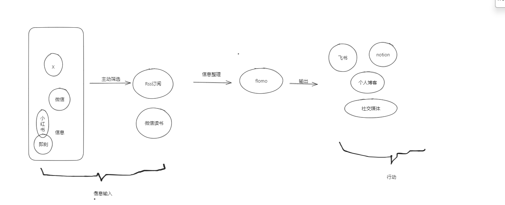

什么样的信息塑造什么样的人，底层的信息输入，肯定决定了这个人的思想和思考逻辑，所以对于信息的输入，是一件严肃重要的事情，你想让自己成为怎样的人，你就需要给自己摄入怎样的信息，这一切就如一个黑盒子一样。我们也如AI一样，数据源越优秀，我们越可能成为一个更加优质的AI，所以保持自己信息输入的优质，想办法提升我们信息输入的质量，这就是我们能为自己负责的方式之一。

# 我的信息输入方式

1.用RSS进行订阅信息，另外魔法上网，使用Google以及AI检索自己想要得到答案的问题，已经成为一个自己本能意识。然后检索的信息，自己收集，整理进入flomo，然后再在FLOMO作为信息整理收集的缓存站，在这里继续发酵整理，然后输出成永久笔记，或者到blog，发表文章到自己的个人博客之中，形成自己的思考与智慧合集。以及这些链路的不断重复推进，形塑自己脑袋的思维，从而让自己在做事情时，调用这些信息，处理日常工作与生活的问题，交给自己的大脑。

